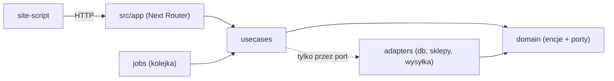
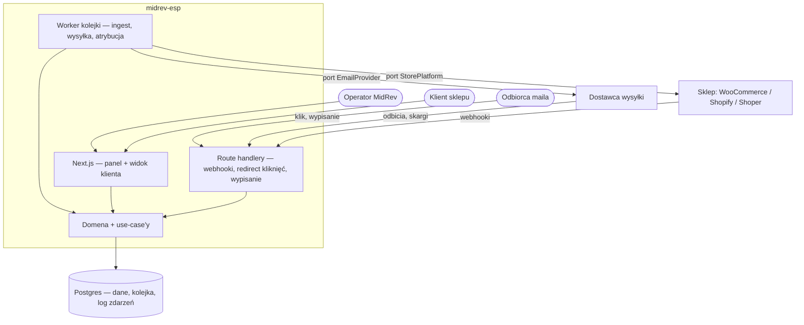
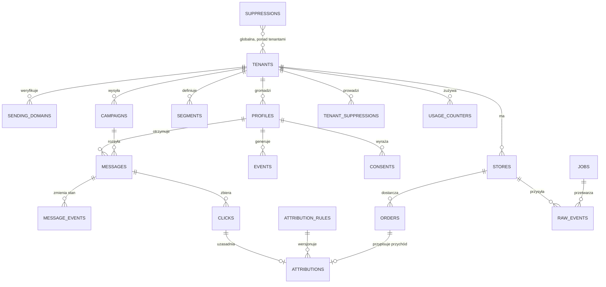

# Architecture Spine — midrev-esp

## Design Paradigm

**Porty i adaptery (hexagonal), z dwufazowym ingestem zdarzeń i kolejką w bazie.**

Wybór wynika z jednej właściwości tego produktu: wszystko, co niesie największe ryzyko biznesowe — dostawca wysyłki, platforma sklepowa — jest wymienne, a wymiana musi być decyzją konfiguracyjną, nie przepisaniem. Rdzeń (profile, zdarzenia, segmenty, kampanie, atrybucja) nie wie, kto wysyła maile ani skąd pochodzą zamówienia.

| Warstwa | Katalog | Czym jest |
|---|---|---|
| Domena | `src/domain/` | encje, reguły, definicje portów. Zero zależności wychodzących |
| Zastosowania | `src/usecases/` | use-case'y: jedno wejście na każdą zmianę stanu |
| Adaptery | `src/adapters/` | baza, platformy sklepowe, dostawca wysyłki, magazyn plików |
| Praca w tle | `src/jobs/` | handlery kolejki, wszystkie idempotentne |
| Web | `src/app/` | Next App Router: panel operatora i widok klienta. Nazwa narzucona przez Next, dlatego use-case'y nie mogą tu mieszkać |
| Skrypt on-site | `site-script/` | osobny artefakt, osobny cykl życia |

## Invariants & Rules



Strzałki to dozwolony kierunek zależności, nie schemat wywołań. `domain` nie ma strzałki wychodzącej i to jest cała istota tej reguły.

### AD-1 — Porty i adaptery jako paradygmat

- **Binds:** cały kod
- **Prevents:** wciek SDK dostawcy wysyłki i platformy sklepowej do logiki domenowej, przez co wymiana dostawcy stałaby się przepisaniem
- **Rule:** `domain` nie importuje niczego z `adapters` ani z `web`; zależności wyłącznie do środka; adaptery implementują interfejsy zdefiniowane w `domain`

### AD-2 — Tenant jest parametrem obowiązkowym

- **Binds:** każde zapytanie do bazy
- **Prevents:** wyciek danych między klientami agencji, czyli złamanie umowy powierzenia
- **Rule:** repozytoria przyjmują `tenantId` jako pierwszy argument; zapytanie bez predykatu `tenant_id` nie przechodzi review; każdy moduł ma test cross-tenantowy

### AD-3 — Mutacje wyłącznie przez use-case

- **Binds:** web (server actions, route handlery), joby, skrypty jednorazowe
- **Prevents:** dwa miejsca zapisujące ten sam byt różnymi regułami, na przykład wysyłkę omijającą wykluczenia
- **Rule:** warstwa web i joby wołają use-case; żaden komponent, route ani skrypt nie wykonuje SQL bezpośrednio

### AD-4 — Ingest dwufazowy

- **Binds:** webhooki platform sklepowych i dostawcy wysyłki
- **Prevents:** utratę zdarzenia przy błędzie przetwarzania i przekroczenie okna odpowiedzi webhooka
- **Rule:** endpoint zapisuje surowe zdarzenie do niezmiennego logu z kluczem idempotencji i odpowiada 200; przetworzenie do modelu domenowego wykonuje job czytający ten log

### AD-5 — Kolejka w Postgresie, nie osobny broker

- **Binds:** całą pracę asynchroniczną
- **Prevents:** rozjazd między dwoma źródłami prawdy o stanie oraz koszt utrzymania brokera przy jednoosobowym zespole
- **Rule:** tabela `jobs`, pobieranie przez `SELECT ... FOR UPDATE SKIP LOCKED`, dostarczenie at-least-once, każdy handler idempotentny; utwardzenie pod wolumen w AD-31; próg zmiany architektury zapisany w NFR27

### AD-6 — Wiadomość jest jednostką wysyłki z unikalnością wymuszoną w bazie

- **Binds:** kampanie i automatyzacje
- **Prevents:** podwójną wysyłkę po restarcie procesu i ciche pominięcie odbiorcy
- **Rule:** rekord w `messages` powstaje przed wywołaniem dostawcy, z unikalnością wg AD-26 (obejmuje też automatyzacje); stan żyje w `message_events` wg AD-22, nie w kolumnie nadpisywanej przez dwie ścieżki; ponowienie nie tworzy nowego rekordu, tylko domyka istniejący wg AD-23

### AD-7 — Port EmailProvider

- **Binds:** całą wysyłkę
- **Prevents:** związanie produktu z jednym dostawcą, zanim zamknie się research kosztowy
- **Rule:** interfejs w `domain` (`send`, `verifyDomain`, `listDomainRecords`, `parseWebhook`, `quotaStatus`); adapter per dostawca; poświadczenia per tenant; żaden kod poza adapterem nie zna nazwy dostawcy

### AD-8 — Port StorePlatform z rejestrem możliwości

- **Binds:** WooCommerce, Shopify, Shoper i każdą kolejną platformę
- **Prevents:** rozjazd modelu danych między adapterami oraz oferowanie klientowi funkcji, której jego platforma nie obsługuje
- **Rule:** jeden wewnętrzny kontrakt (`Customer`, `Order`, `Product`, `Cart`, `StoreEvent`); adapter deklaruje `capabilities`; wspólny zestaw testów akceptacyjnych obowiązuje każdy adapter

### AD-9 — Wykluczenia jako jedyna brama wysyłki

- **Binds:** kampanie, automatyzacje, wysyłki testowe, każdą przyszłą ścieżkę
- **Prevents:** wysłanie do osoby wypisanej lub zgłaszającej skargę ścieżką, która ominęła sprawdzenie
- **Rule:** jeden use-case buduje listę odbiorców i tylko on odpytuje wykluczenia; adapter dostawcy przyjmuje wyłącznie adresy pochodzące z tego use-case. Lista jest jednak wyłącznie kandydatem: wiążące sprawdzenie następuje bezpośrednio przed wysyłką wg AD-25, bo między budową listy a startem wysyłki mijają dni

### AD-10 — Dwie daty, zawsze UTC

- **Binds:** każde zdarzenie i każdy import
- **Prevents:** fałszowanie raportów przychodu datą importu zamiast datą zdarzenia (błąd z historii projektu)
- **Rule:** kolumny `timestamptz`; `occurred_at` pochodzi ze źródła i jest obowiązkowy przy zapisie, `recorded_at` ustawia baza; zapis bez `occurred_at` jest błędem, nie wartością domyślną. Uwaga wdrożeniowa: `0001_init.sql` ma na tej kolumnie `default now()`, czyli baza dziś aktywnie łamie tę regułę. Usuwa to migracja 0002 (AD-30)

### AD-11 — Kwoty w jednostkach minorowych

- **Binds:** zamówienia, przychód, atrybucję, metering
- **Prevents:** błędy zaokrągleń w liczbach, na podstawie których klient ocenia kanał
- **Rule:** `integer` w groszach plus kod waluty ISO 4217; zero liczb zmiennoprzecinkowych w kwotach; konwersja wyłącznie w warstwie prezentacji

### AD-12 — Migracje append-only z kontrolą sumy kontrolnej [ADOPTED]

- **Binds:** schemat bazy
- **Prevents:** cichą rozbieżność między środowiskami po edycji zastosowanej migracji
- **Rule:** zmiana schematu to nowy plik; edycja zastosowanego pliku jest błędem; `migrate.ts` przerywa pracę przy rozjeździe sumy kontrolnej

### AD-13 — Sekrety tenantów szyfrowane w spoczynku

- **Binds:** poświadczenia sklepów, klucze dostawców, tokeny
- **Prevents:** kompromitację sklepu klienta przez zrzut bazy albo wpis w logu
- **Rule:** szyfrowanie symetryczne kluczem ze środowiska; w kodzie typ opakowany bez domyślnej serializacji do napisu; wartość nigdy nie trafia do logu ani do odpowiedzi API

### AD-14 — Atrybucja jest projekcją liczoną przez job

- **Binds:** raporty przychodu
- **Prevents:** dwie różne liczby dla tej samej kampanii zależnie od momentu odczytu, oraz wolne raporty przy rosnącym wolumenie
- **Rule:** job po zamówieniu szuka kwalifikującego kliknięcia w oknie tenanta i zapisuje rekord atrybucji; raport czyta wyłącznie zapisane rekordy; zmiana okna przelicza projekcję jawnie, nie po cichu

### AD-15 — Identyfikatory: UUIDv7 wewnątrz, prefiksowane na zewnątrz

- **Binds:** wszystkie encje
- **Prevents:** użycie identyfikatora jednej encji w miejscu innej oraz wyciek liczebności przez sekwencję
- **Rule:** klucz główny `uuid` w wersji 7, generowany natywnie przez Postgres 18 (`uuidv7()`) albo w Node biblioteką `uuid` funkcją `v7()`; `crypto.randomUUID()` jest zakazane, bo daje wersję 4 i po cichu psuje uporządkowanie indeksu. Identyfikator pokazywany na zewnątrz w formie `prefiks_uuid` (`ten_`, `prf_`, `cmp_`, `msg_`). Klucz główny nigdy nie służy jako token w linku (AD-33)

### AD-16 — Zgody i historia wysyłek są append-only i objęte ciągłą ochroną

- **Binds:** `consents`, `messages`, `suppressions`
- **Prevents:** stan po awarii, w którym nie wiadomo komu wolno wysłać i kto już dostał wiadomość (napięcie zapisane w NFR18)
- **Rule:** brak `UPDATE` i `DELETE` na tych tabelach poza ścieżką RODO, która anonimizuje zamiast usuwać; te tabele wymagają odtwarzania do punktu w czasie, nie dobowej kopii. Stan wiadomości nie jest wyjątkiem od tej reguły, tylko osobnym strumieniem zdarzeń (AD-22)

### AD-17 — Mutacje w webie przez server actions opakowujące use-case

- **Binds:** całą warstwę web
- **Prevents:** logikę biznesową rozproszoną po komponentach i drugą ścieżkę zapisu obok use-case
- **Rule:** komponenty serwerowe czytają przez zapytania warstwy `app`; mutacja to server action będąca cienkim opakowaniem use-case z walidacją wejścia zodem

### AD-18 — Ręcznie pisany SQL w repozytoriach, bez ORM

- **Binds:** całą warstwę danych
- **Prevents:** dwa style dostępu do bazy obok siebie oraz walkę z ORM przy zapytaniach segmentacyjnych i atrybucyjnych, które i tak są ręcznym SQL
- **Rule:** repozytorium w `adapters/db`, SQL w jednym miejscu, wynik parsowany zodem na granicy; brak zapytań w `web` i w `domain`

### AD-19 — Skrypt on-site jest osobnym artefaktem wersjonowanym

- **Binds:** tracking kliknięć i wiązanie sesji z profilem
- **Prevents:** sytuację, w której zmiana w aplikacji psuje skrypt siedzący w przeglądarkach odbiorców, bez możliwości wycofania
- **Rule:** budowany osobno, serwowany pod adresem zawierającym wersję, kontrakt danych zmienia się wyłącznie w sposób wstecznie zgodny

### AD-20 — Testy integracyjne na realnym Postgresie [ADOPTED]

- **Binds:** każdy moduł dotykający danych
- **Prevents:** zielone testy przy zepsutych ograniczeniach bazy, czyli dokładnie tę klasę błędów, którą złapało review fundamentu
- **Rule:** wzorzec z `tests/cdp.test.ts`; każdy moduł ma test zachowania ze specyfikacji i test izolacji tenanta; brak mocków warstwy bazy

### AD-21 — Tenant pochodzi z sesji, nigdy z żądania

- **Binds:** każdy use-case i każdy endpoint
- **Prevents:** dostęp do cudzego tenanta przez podanie identyfikatora w żądaniu, co przy operatorze mającym dostęp do wielu tenantów (FR2) jest otwartą furtką
- **Rule:** use-case przyjmuje `ActorContext` z `tenantId` i rolą; wartość pochodzi z sesji, nigdy z ciała ani z parametrów żądania; sprawdzenie uprawnienia dzieje się w `usecases`, nie w warstwie web

### AD-22 — Wiadomości są niemutowalne, stan żyje w strumieniu zdarzeń

- **Binds:** wysyłkę i webhooki dostawcy
- **Prevents:** sprzeczność AD-6 z AD-16 oraz wyścig, w którym worker zapisuje `sent` i nadpisuje `delivered` albo `bounced` przysłane webhookiem
- **Rule:** `message_events` append-only z unikalnością `(message_id, event_type)`; kolumna `current_state` jest projekcją aktualizowaną monotonicznie warunkiem `state_rank < nowy_rank`; poza nią żadnych `UPDATE` na `messages`

### AD-23 — Idempotencja wysyłki od końca do końca

- **Binds:** port `EmailProvider` i worker wysyłki
- **Prevents:** drugą wysyłkę do tych samych ludzi, gdy worker zginie między wywołaniem dostawcy a zapisem stanu
- **Rule:** `send` przyjmuje obowiązkowy `idempotencyKey` równy identyfikatorowi wiadomości; `queued → sending` zapisywane **przed** wywołaniem, `sending → sent` po nim wraz z identyfikatorem u dostawcy; partia nigdy nie jest jedną transakcją; wiadomość zastana w `sending` jest przed ponowieniem sprawdzana u dostawcy po kluczu

### AD-24 — Klucz idempotencji ingestu opisuje byt, nie kanał

- **Binds:** webhooki i import historyczny
- **Prevents:** podwójne zamówienie i podwójnie policzony przychód, gdy zamówienie wpada webhookiem w trakcie trwającego importu
- **Rule:** kształt `platform : tenant_id : entity : external_id : source_version`, budowany jedną funkcją adaptera wołaną przez obie ścieżki

### AD-25 — `canSendTo` jest wiążącą bramką w transakcji wysyłki

- **Binds:** kampanie, automatyzacje, wysyłki testowe
- **Prevents:** mail do osoby, która wypisała się po zbudowaniu listy odbiorców, a przed startem wysyłki. Akceptacja klienta i warmup rozciągają tę lukę na dni, więc FR51 „natychmiast" bez tej reguły nie jest prawdą
- **Rule:** lista odbiorców jest kandydatem, nie decyzją; `canSendTo(tenant, profile, source)` sprawdza wykluczenia globalne i tenanta, zgodę, rejestr trybu równoległego oraz limity w tej samej transakcji co `queued → sending`; odmowa zapisuje stan z powodem, nie milczy

### AD-26 — Unikalność wiadomości obejmuje także automatyzacje

- **Binds:** `messages`
- **Prevents:** obejście ochrony przed podwójną wysyłką przez journey, gdzie `campaign_id` jest `NULL`, a dwa `NULL`-e nie są w Postgresie sobie równe. Naprawa w fazie 2 wymagałaby przebudowy tabeli, której AD-16 zabrania ruszać
- **Rule:** unikalność `(tenant_id, source_type, source_id, profile_id)` zamiast `(campaign_id, profile_id)`

### AD-27 — Wykluczenia są dwupoziomowe

- **Binds:** suppression i każdą ścieżkę wysyłki
- **Prevents:** rozjazd między globalną listą chroniącą reputację platformy a listą wypisań konkretnego sklepu; FR28 wymaga obu naraz
- **Rule:** globalna tabela `suppressions` bez `tenant_id` (istniejąca, po adresie znormalizowanym) plus `tenant_suppressions`; `canSendTo` sprawdza obie

### AD-28 — Reguła atrybucji jest bytem wersjonowanym

- **Binds:** atrybucję i raporty
- **Prevents:** rosnącą z dnia na dzień liczbę przychodu u klienta po zmianie okna w trakcie kampanii, bez śladu skąd zmiana. Przy produkcie, którego jedynym kryterium akceptacji jest parytet z Klaviyo, to zabija zaufanie do liczb
- **Rule:** `attribution_rules` z `effective_from`; rekord atrybucji nosi `rule_id`; kampania po starcie ma regułę zamrożoną; przeliczenie tworzy nowy `attribution_run` bez kasowania poprzednich rekordów i jest widoczne w raporcie

### AD-29 — Kontrakt koszyka ustalony teraz

- **Binds:** adaptery platform i zdarzenia koszyka
- **Prevents:** sytuację, w której faza 1 już zapisuje zdarzenia koszyka, kształt wymyśla jeden moduł, a drugi zastaje go nie do użycia
- **Rule:** `Cart` niesie: `externalId`, `profileRef`, pozycje (`sku`, `name`, `qty`, `unitAmountMinor`), `totalMinor`, `currency`, `occurredAt` oraz opcjonalne `abandonedAt`; adapter deklaruje możliwość `cart.abandoned`, a interfejs nie oferuje funkcji opartych na koszyku dla platformy, która jej nie ma

### AD-30 — Migracja 0002 jest warunkiem wejścia do dalszych epików

- **Binds:** schemat bazy
- **Prevents:** dalszą pracę na bazie, która aktywnie odtwarza błąd z historii projektu: `occurred_at ... default now()` to dokładnie to, czego zabrania AD-10, a testy CDP dziś na tym przechodzą
- **Rule:** nowy plik `0002` usuwa `default` z `occurred_at`, ustawia `uuidv7()` na kluczach głównych i dodaje tabele fundamentu (`stores`, `raw_events`, `jobs`); pliku `0001` nie wolno edytować (AD-12). Tabele należące do późniejszych epików (`tenant_suppressions`, `message_events`, `attribution_rules`) dochodzą własnymi migracjami razem z kodem, który ich używa, żeby migracja nie wyprzedzała testów

### AD-31 — Kolejka utwardzona pod wolumen

- **Binds:** `jobs` i workery
- **Prevents:** przypięcie horyzontu MVCC i churn wierszy przy milionie wiadomości miesięcznie oraz zajęte zadanie trzymane przez wywołanie sieciowe
- **Rule:** zero wywołań sieciowych wewnątrz transakcji zajmującej zadanie; zajmowanie partiami; partycjonowanie `jobs` po dniu z `DROP PARTITION` zamiast `DELETE`; osobne ustawienia autovacuum dla `jobs` i `raw_events`

### AD-32 — Port TemplateEditor

- **Binds:** moduł kampanii
- **Prevents:** wrośnięcie konkretnego edytora w moduł kampanii. Unlayer okazał się komponentem hostowanym u dostawcy: white-label przy odsprzedaży kosztuje od 250 USD miesięcznie i dokłada podprocesora do umowy powierzenia
- **Rule:** moduł kampanii zna wyłącznie `load`, `save`, `renderHtml`, `assets` i `capabilities`; wybór edytora jest konfiguracją, nie zależnością modułu. Domyślny w fazie 1: **Maily.to** (MIT, w całości self-hosted, sprawdzony na React 19). Adapter ma obowiązek wyciąć z wygenerowanego HTML zaszyty `@font-face` wskazujący na obcy serwer, bo inaczej każde otwarcie maila ujawnia adres IP odbiorcy osobie trzeciej, czego nie ma w żadnej umowie powierzenia. Utrwalony HTML należy do wiadomości, nie do kampanii, a blok produktowy jest referencją rozwiązywaną tuż przed wysyłką, żeby mail nie pokazywał ceny sprzed tygodnia

### AD-33 — Token kliknięcia jest osobnym sekretem

- **Binds:** tracking kliknięć
- **Prevents:** użycie identyfikatora wiadomości jako tokenu w linku, co ujawnia strukturę i pozwala zgadywać cudze tokeny (konflikt AD-15 z NFR11)
- **Rule:** kolumna `click_token` generowana losowo, co najmniej 128 bitów entropii, bez związku z kluczem głównym; token nie zawiera adresu odbiorcy w żadnej odwracalnej postaci

## Consistency Conventions

| Concern | Convention |
|---|---|
| Nazewnictwo | baza `snake_case` liczba mnoga (`profiles`, `sending_domains`); TypeScript `camelCase`; pliki `kebab-case`; use-case nazywany czasownikiem (`send-campaign.ts`) |
| Zdarzenia | `rzeczownik.czas_przeszły` w formie ustalonej: `order.created`, `email.clicked`, `popup.submitted`; nazwa zdarzenia jest kontraktem, zmiana wymaga nowej nazwy |
| Identyfikatory i daty | UUIDv7 (AD-15), `timestamptz` w UTC, para `occurred_at` / `recorded_at` (AD-10) |
| Kwoty | integer w groszach + waluta ISO (AD-11) |
| Błędy | wynik use-case to `{ ok: true, data }` albo `{ ok: false, error: { code, message } }`; wyjątek zarezerwowany dla awarii infrastruktury, nie dla odmowy biznesowej |
| Walidacja | zod na każdej granicy: wejście server action, payload webhooka, wiersz z bazy, odpowiedź adaptera |
| Logi | strukturalne JSON z `tenant_id`, `job_id`, `correlation_id`; zero sekretów i zero adresów e-mail w treści logu |
| Konfiguracja | zmienne środowiskowe walidowane zodem przy starcie; brak `process.env` poza modułem konfiguracji |
| Alerty | zdarzenie wymagające człowieka idzie kanałem alertowym z opisem reakcji (NFR38), nigdy do `console.error` |
| Praca w tle | każdy handler idempotentny, z limitem prób i przejściem do kolejki błędów po jego wyczerpaniu (NFR30) |

## Structural Seed

**Stack i wersje** — sprawdzone w rejestrze npm i u dostawców 27.08.2026: Node 24 LTS (24.20.0), Next.js 16.3.3, React 19.2.8, Tailwind CSS 4.3.3, TypeScript 6.0.3, PostgreSQL 18.6, pg 8.23.0, zod 4.4.3, vitest 4.1.11, uuid 14 (funkcja `v7`).

TypeScript celowo na 6.0.3, nie na 7.0.2: siódemka wyrzuciła JavaScriptowe Compiler API, Next wymaga wtedy osobnej flagi, a `vitest --typecheck` przestaje działać. Node 24, bo dwudziestka jest po końcu wsparcia od 30.04.2026. PostgreSQL 18, bo od tej wersji `uuidv7()` jest natywne, co przy milionie wierszy miesięcznie decyduje o zachowaniu indeksów. Próg przeglądarek wyznacza Tailwind 4 (Firefox 128), nie Next.





```text
midrev-esp/
  src/
    domain/          # encje, reguły, definicje portów — zero zależności wychodzących
    usecases/        # jedno wejście na każdą zmianę stanu (NIE app/ — tę nazwę zabiera Next)
    adapters/
      db/            # repozytoria, ręczny SQL
      store/         # woo/ shopify/ shoper/ — implementacje portu StorePlatform
      email/         # implementacje portu EmailProvider
      editor/        # implementacje portu TemplateEditor
    jobs/            # handlery kolejki, wszystkie idempotentne
    app/             # Next App Router: (operator)/ i (klient)/, server actions
  site-script/       # skrypt on-site, osobny build i wersjonowanie
  migrations/        # append-only, kontrola sumy kontrolnej
  tests/             # integracyjne na sandboxie, bez mocków bazy
```

## Capability → Architecture Map

| Obszar (FR) | Żyje w | Rządzi tym |
|---|---|---|
| FR1–FR7 dostęp i tenanty | `usecases/auth`, `adapters/db` | AD-2, AD-3, AD-21 |
| FR8–FR17 połączenie sklepu | `adapters/store/*`, `jobs/ingest` | AD-4, AD-8, AD-10, AD-24, AD-29 |
| FR18–FR22 profile i zdarzenia | `domain/profile`, `usecases/profiles` | AD-2, AD-10, AD-16 |
| FR23–FR31 odbiorcy i zgody | `domain/audience`, `usecases/segments` | AD-9, AD-25, AD-27 |
| FR32–FR42 kampanie | `usecases/campaigns`, `app/(operator)` | AD-3, AD-17, AD-32 |
| FR43–FR53 wysyłka | `adapters/email`, `jobs/send` | AD-6, AD-7, AD-22, AD-23, AD-25, AD-26 |
| FR54–FR61 atrybucja i raporty | `jobs/attribution`, `usecases/reports`, `site-script` | AD-11, AD-14, AD-19, AD-28, AD-33 |
| FR62–FR65 migracja z ESP | `usecases/import`, `jobs/import` | AD-10, AD-24, AD-25 |
| FR66–FR69 automatyzacje | `domain/journey`, `jobs/journey` | AD-5, AD-25, AD-26 |
| FR70–FR72 nadzór i metering | `jobs/monitor`, `usecases/usage` | AD-5, AD-16, AD-31 |

## Deferred

| Odłożone | Dlaczego może czekać |
|---|---|
| Wybór dostawcy wysyłki | AD-7 czyni z tego konfigurację. Research zamknięty: rekomendacja Amazon SES eu-central-1 z funkcją Tenants (160 USD za 1 mln), drugi tor EmailLabs. Czeka na decyzję właściciela i na założenie konta, bo warmup domeny trwa około miesiąca |
| Hosting i sposób uruchamiania workera | do czasu pierwszego realnego klienta pracujemy lokalnie; wybór wpływa tylko na uruchomienie procesu i realizację ciągłej ochrony z AD-16 |
| Silnik automatyzacji: własny na kolejce z AD-5 czy Dittofeed pod spodem | dopiero faza 2, a wybór zależy od tego, ile z reguł segmentacji da się ponownie użyć w warunkach journey |
| Import szablonów z innego ESP przez MJML | MJML dokłada trzecią reprezentację między JSON a HTML, więc w fazie 1 jest zbędny. Wraca jako osobny adapter przy migracji szablonów klienta (FR62-FR65) |
| Model uprawnień drobnoziarnistych | macierz z PRD wystarcza na fazę 1; pełny RBAC dopiero przy większej liczbie ludzi po stronie klienta |
| RLS w Postgresie jako druga warstwa izolacji | AD-2 daje izolację na poziomie zapytań; RLS dokładamy przy pierwszym realnym kliencie, nie w sandboxie |
